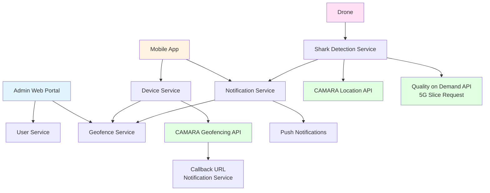
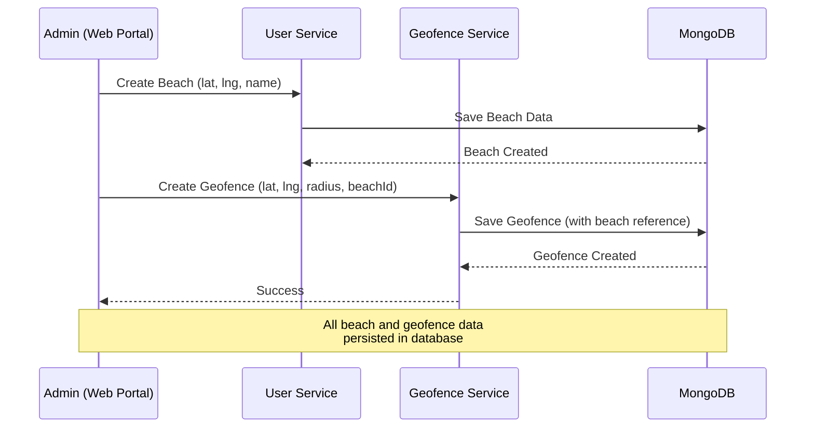
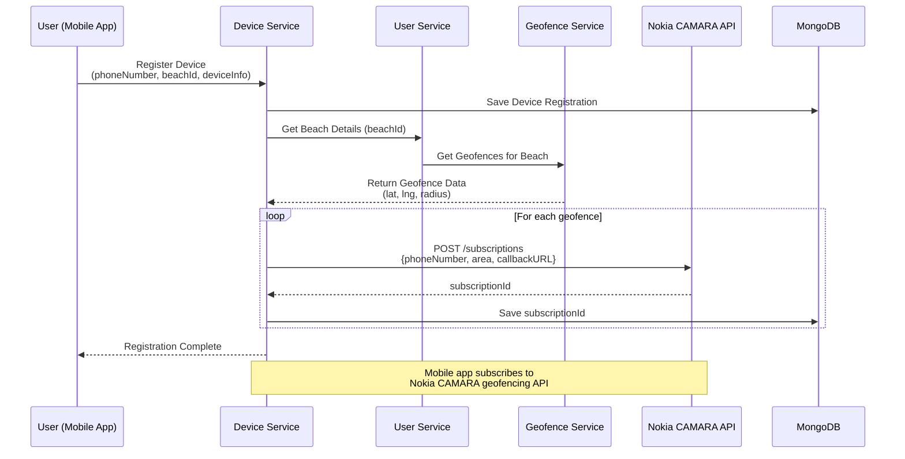
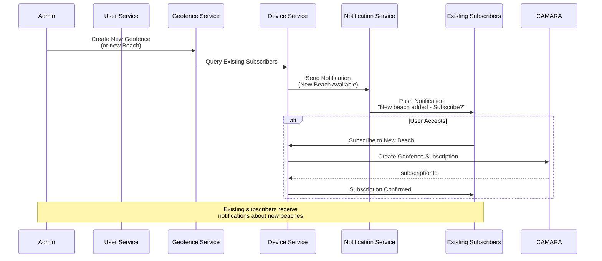
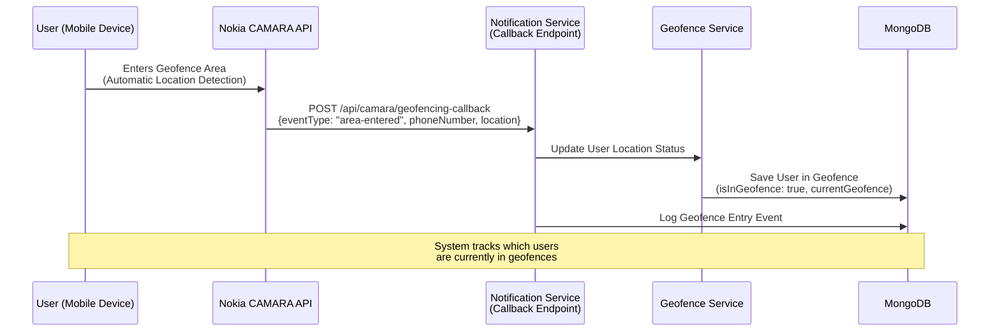
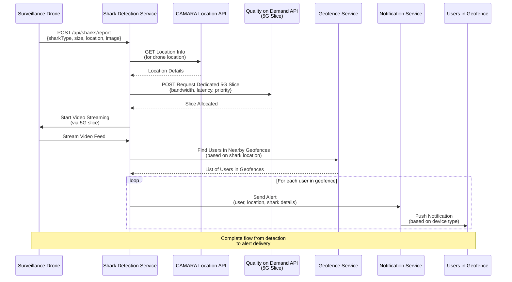
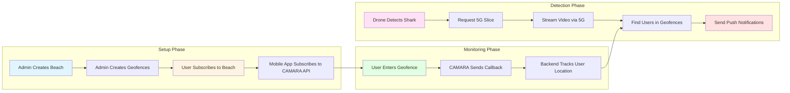
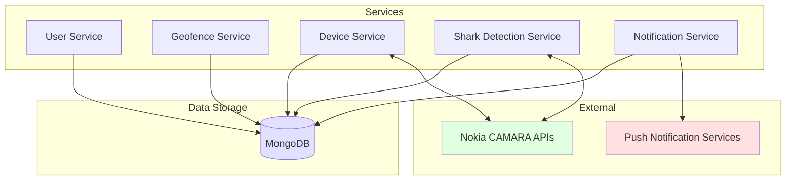
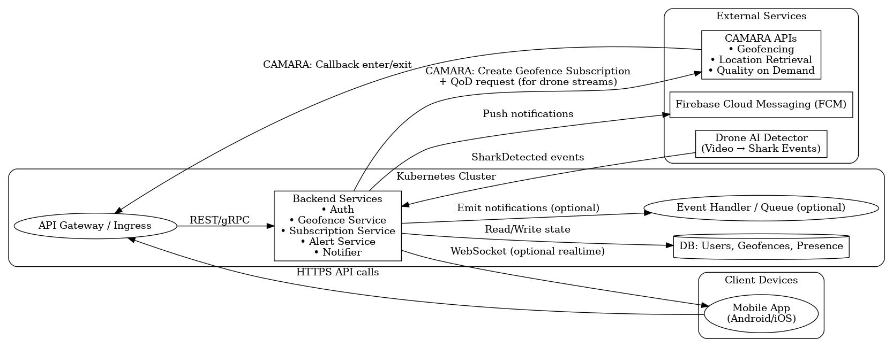

# Shark Detection System Architecture

## Overview

The Shark Detection System is a comprehensive IoT platform that integrates Nokia CAMARA APIs, 5G network slicing, and real-time geofencing to provide proactive shark detection alerts to beachgoers. The system enables surfers and other beach visitors to receive timely alerts when sharks are detected in their vicinity.

## System Architecture Flow

### High-Level Architecture

## Detailed Architecture Components

### 1. Beach and Geofence Management

Administrators use the web portal to manage beaches and create geofences around them.

**Key Operations:**
- Admin creates beaches with latitude, longitude, and name
- Admin creates geofences around beaches using:
  - Center point (latitude, longitude)
  - Radius (in meters)
  - Association with beach ID
- All data is stored in MongoDB for persistence

### 2. User Subscription Process

When a user subscribes to alerts for a beach, the system automatically sets up CAMARA geofencing subscriptions.

**Subscription Flow:**
1. User registers device via mobile app with phone number and beach selection
2. Backend retrieves all geofences associated with the selected beach
3. For each geofence, the backend makes an API call to Nokia CAMARA Geofencing API with:
   - Device phone number
   - Geofence area (center point and radius)
   - Callback URL (backend endpoint)
4. CAMARA API returns a subscription ID
5. Subscription ID is stored in the database

### 3. New Beach/Geofence Notification

When new beaches or geofences are added, existing subscribers are notified.

**For New Geofences on Existing Subscribed Beaches:**
- When a new geofence is added to an already-subscribed beach, the mobile app automatically subscribes to the new geofence via CAMARA API
- No user intervention required

### 4. Geofence Entry Detection

When a subscriber enters a geofence area, CAMARA sends a callback to the backend.

**Geofence Entry Tracking:**
- CAMARA API automatically detects when a device enters a geofence area
- Callback is sent to the backend notification service endpoint
- Backend updates database:
  - User's current location status
  - Which geofence they entered
  - Timestamp of entry
- This information is used later to determine who should receive shark alerts

### 5. Shark Detection and Alert Flow

When a drone detects a shark, the system requests a 5G slice, streams video, and sends alerts to nearby users.

**Shark Detection Process:**
1. **Detection**: Drone detects shark and reports to Shark Detection Service with:
   - Shark type and size
   - GPS location (latitude, longitude)
   - Detection image/video
   - Confidence score

2. **Location Retrieval**: Service uses CAMARA Location Retrieval API to get precise drone location

3. **5G Slice Request**: Service requests dedicated 5G network slice via Quality on Demand API:
   - High bandwidth for video streaming
   - Low latency for real-time alerts
   - Priority QoS parameters

4. **Video Streaming**: Once slice is allocated, drone streams high-quality video to backend via the dedicated 5G connection

5. **User Identification**: System queries geofence service to find all users currently inside geofences near the shark location

6. **Alert Distribution**: Push notifications are sent to identified users based on their device type (smartwatch, phone, fitness band)

### 6. Complete End-to-End Flow

## Component Interactions

### API Integrations

#### Nokia CAMARA APIs

1. **Geofencing Subscriptions API**
   - **Endpoint**: `POST /subscriptions`
   - **Purpose**: Subscribe devices to geofence areas
   - **Payload**: Device phone number, geofence area (center + radius), callback URL
   - **Response**: Subscription ID

2. **Location Retrieval API**
   - **Endpoint**: `GET /location`
   - **Purpose**: Retrieve precise device/drone location
   - **Used By**: Shark Detection Service to get drone location

3. **Quality on Demand (QoD) API**
   - **Endpoint**: `POST /slice-request`
   - **Purpose**: Request dedicated 5G network slice
   - **Parameters**: Bandwidth, latency, QoS class, priority
   - **Used By**: Shark Detection Service for video streaming

#### Internal APIs

- **User Service**: Beach management, user accounts
- **Geofence Service**: Geofence CRUD operations, location checking
- **Device Service**: Device registration, CAMARA subscription management
- **Shark Detection Service**: Shark detection processing, alert triggering
- **Notification Service**: Push notification delivery, WebSocket connections
- **Drone Service**: Drone management and status tracking

## Data Flow Architecture

## Technology Stack

- **Backend**: Node.js with Express
- **Database**: MongoDB
- **Message Queue**: Kafka (for asynchronous processing)
- **Real-time Communication**: WebSocket (Socket.io)
- **External APIs**: Nokia CAMARA APIs
- **Deployment**: Docker containers orchestrated via Docker Compose
- **Reverse Proxy**: Caddy

## Key Features

1. **Proactive Geofencing**: CAMARA API automatically tracks user locations
2. **5G Network Slicing**: Dedicated network slices for high-quality video streaming
3. **Real-time Alerts**: Instant push notifications based on proximity
4. **Scalable Architecture**: Microservices-based design for horizontal scaling
5. **Multi-device Support**: Smartwatch, phone, and fitness band compatibility
6. **Location Tracking**: Persistent tracking of user locations within geofences

## Security Considerations

- API authentication and authorization
- Secure callback endpoints for CAMARA API
- Device identification via IMEI, IMSI, and phone number
- Encrypted communication channels
- User privacy compliance (location data handling)

## Scalability

- Microservices architecture allows independent scaling
- Kafka enables asynchronous processing of high-volume events
- MongoDB sharding support for large-scale data
- Stateless services for horizontal scaling
- Load balancing via API Gateway

---

## Deployment Diagram

---

*This architecture document provides a comprehensive overview of the Shark Detection System's design, data flows, and component interactions. For detailed deployment instructions, see [DEPLOYMENT.md](./DEPLOYMENT.md).*
