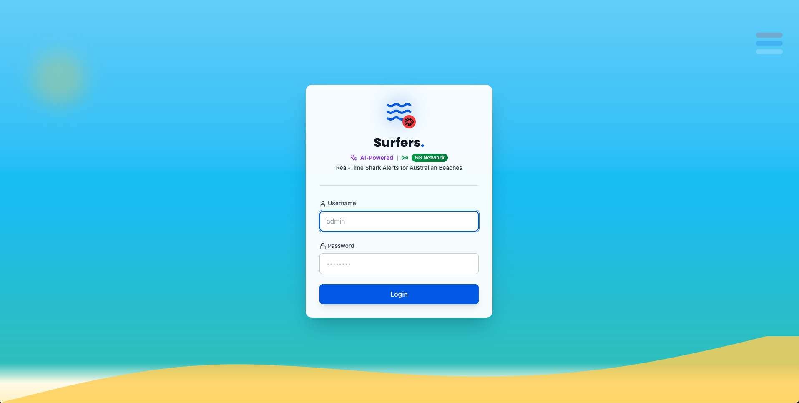
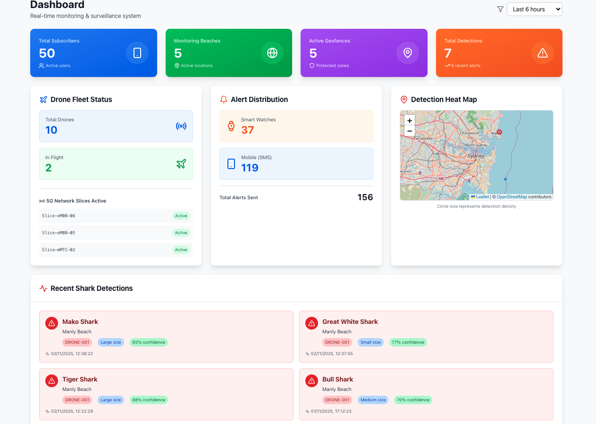
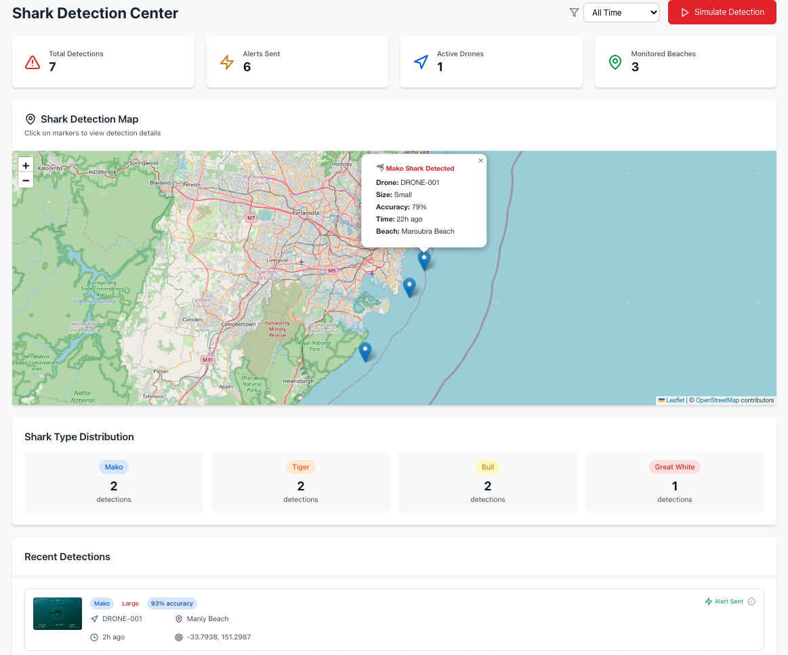
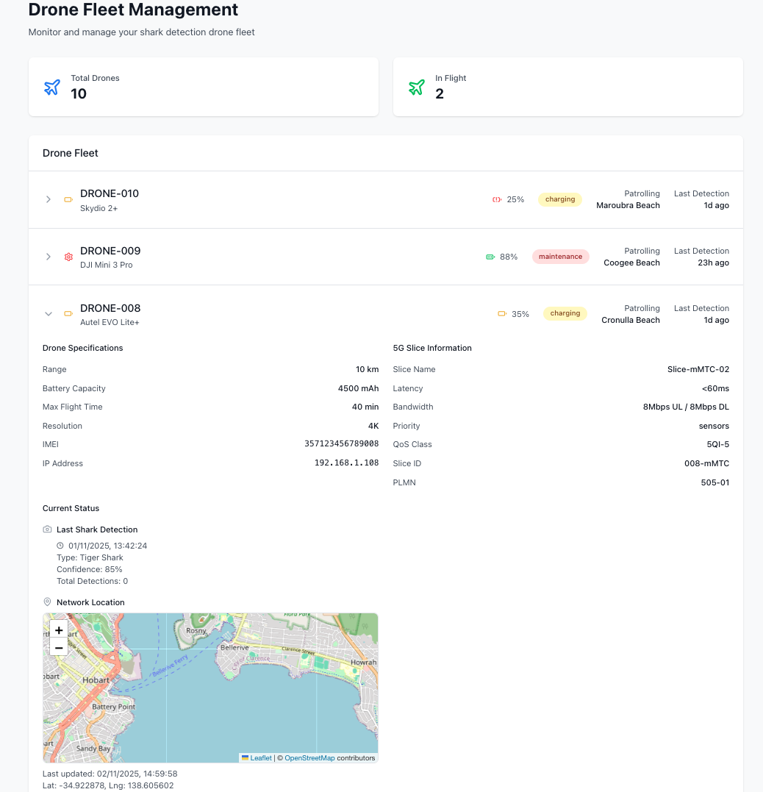
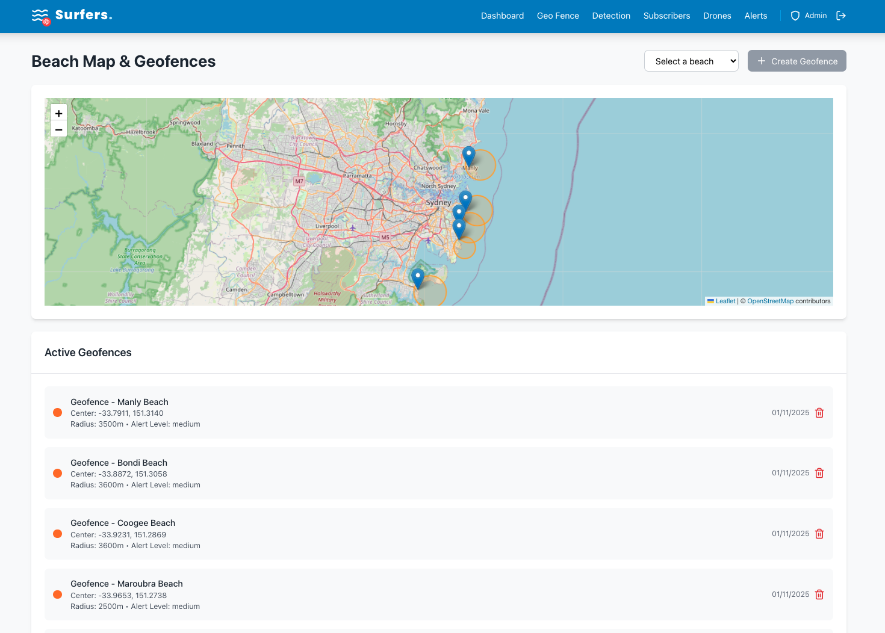
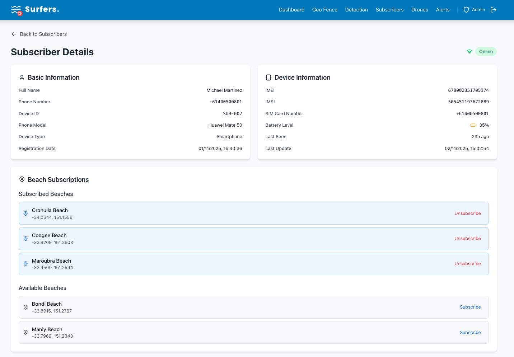
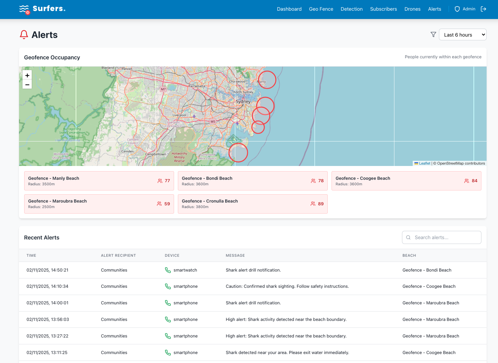

# Surfers. - User Guide 📖

Welcome to **Surfers.** - AI-Powered Shark Alerts Powered by 5G. This guide will help you navigate and use all the features of the system.

## 🌊 Overview

Surfers. is a real-time shark detection and alert system designed to keep Australian beachgoers safe. The system uses:

- **5G Network Slicing** for ultra-low latency drone communication
- **AI-Powered Detection** for accurate shark identification
- **Real-Time Geofencing** to alert people in danger zones
- **Multi-Device Alerts** via smartphones, smart watches, and bands

## 🔐 Getting Started

### Login
- **Admin Username**: `admin`
- **Admin Password**: `***`

> Note: Demo user accounts are available in the seed data. See deployment docs for more info.

## 📸 Screenshots

### Login Page

*AI-Powered Shark Alerts login with Australian beach theme*

### Dashboard

*Real-time metrics, 5G slices, and shark detection heat map*

### Detection Map

*Live shark detections with interactive map*

### Drone Management

*Fleet management with 5G slice information*

### Geo Fence

*Beach safety zones and geofence management*

### Subscribers

*Subscriber and device management*

### Alerts

*Alert monitoring and geofence occupancy*

## 📋 Main Features

### 1. Dashboard 🏠

The Dashboard provides a comprehensive overview of the entire system:

- **Real-Time Metrics**:
  - Total subscribers
  - Active beaches
  - Active geofences
  - Drone fleet status
  - Total alerts sent
  - Alert distribution by device type

- **5G Slices**:
  - View active 5G network slices
  - Monitor slice performance

- **Shark Detection Heat Map**:
  - Interactive map showing shark detection density
  - Clickable zones with detailed statistics
  - Filter by time periods (Last 6 hours, Last 24 hours, etc.)

### 2. Detection 🦈

The Detection page displays real-time shark detections from drones:

- **Interactive Map**:
  - Pin markers for each detection
  - Click pins for details (date, drone name, accuracy)
  - Auto-zoom to fit all detections

- **Detection Details**:
  - Time and date of detection
  - Drone name and status
  - Detection accuracy percentage
  - Shark type and estimated size

- **Time Filters**:
  - Last 12 hours
  - Last 2 days
  - Last 5 days
  - Custom date range

### 3. Drones 🚁

Manage your drone fleet:

- **Fleet Overview**:
  - Total drones
  - In-flight count
  - Maintenance status
  - Charging status

- **Drone Details**:
  - Click any drone to expand details
  - View specifications (brand, range, battery, resolution)
  - Check current status
  - Monitor last shark detection
  - View 5G slice information
  - Real-time location via Telstra API

- **5G Slice Information**:
  - Slice name
  - Latency metrics
  - Bandwidth allocation
  - Priority level

- **Location Tracking**:
  - Live location updates
  - Network-based positioning
  - Last updated timestamp

### 4. Geo Fence 📍

Manage geofenced zones around beaches:

- **Interactive Map**:
  - View all geofences
  - Circle radius visualization
  - Color-coded by status

- **Geofence Management**:
  - Create new geofences
  - Activate/deactivate zones
  - Edit radius and location
  - View subscriber counts per zone

- **Beach Association**:
  - Link geofences to specific beaches
  - Monitor activity per beach

### 5. Subscribers 👥

Manage all subscribers and their devices:

- **Subscriber List**:
  - Search and filter
  - Paginated view
  - Device type indicators
  - Status monitoring

- **Subscriber Details**:
  - Full profile information
  - Device specifications
  - Location tracking
  - Alert history
  - Beach subscriptions

- **Add Subscribers**:
  - Manual registration
  - Bulk import (future feature)
  - Device assignment

### 6. Alerts 📢

Monitor all alert activity:

- **Recent Alerts Table**:
  - Time-sorted alerts
  - Search functionality
  - Pagination (20 per page)
  - Device type indicators

- **Geofence Occupancy**:
  - Map showing active geofences
  - People count per zone
  - Real-time updates

- **Alert Distribution**:
  - Persona categories
  - Device breakdown
  - Time-based filtering

- **Alert Types**:
  - Shark detected warnings
  - Evacuation notices
  - All-clear announcements

## 🎯 Common Workflows

### Scenario 1: New Shark Detection

1. Drone detects a shark near Bondi Beach
2. Detection appears on **Detection** page
3. System identifies subscribers in the geofence
4. Alerts sent via **Alerts** page
5. Dashboard updates with new metrics

### Scenario 2: Monitoring Drone Fleet

1. Navigate to **Drones** page
2. Review fleet status summary
3. Click specific drone for details
4. Check last detection and 5G slice info
5. Monitor location in real-time

### Scenario 3: Managing Beach Coverage

1. Go to **Geo Fence** page
2. Create geofence around new beach
3. Set appropriate radius
4. Activate zone
5. Monitor subscriber sign-ups

### Scenario 4: Alert Analysis

1. Open **Alerts** page
2. Select time period
3. Search for specific personas
4. Review geofence occupancy map
5. Analyze device type distribution

## 🔧 Tips & Best Practices

### Dashboard Monitoring
- Check daily for anomalies
- Monitor 5G slice performance
- Watch for unusual alert patterns

### Drone Management
- Schedule maintenance during off-peak
- Keep batteries optimized
- Rotate drones for even wear

### Geofence Optimization
- Adjust radius based on beach size
- Consider crowd density
- Account for typical swimming areas

### Alert Management
- Review false positive rates
- Calibrate detection sensitivity
- Monitor response times

## 🌐 Technology Stack

- **Frontend**: React.js with Tailwind CSS
- **Backend**: Node.js microservices
- **Database**: MongoDB
- **Caching** (Optional/Future): Redis - Reserved for future features
- **Real-Time**: WebSocket/Socket.io
- **Maps**: React Leaflet + OpenStreetMap
- **5G Integration**: Network Slicing
- **Location**: Telstra API

## 📞 Support

For technical support or deployment issues, refer to:
- `docs/DEPLOYMENT.md` - Deployment guide
- `docs/QUICK_DEPLOY.md` - Quick setup guide
- `docs/DEMO_GUIDE.md` - Demo scenarios

## 🎬 Demo Walkthrough

1. **Login** with admin credentials
2. **Dashboard** - Review system overview
3. **Drones** - Check fleet status
4. **Detection** - Simulate shark detection
5. **Alerts** - Review alert activity
6. **Subscribers** - View subscriber details
7. **Geo Fence** - Manage beach zones

---

**Stay Safe. Stay Informed. Surfers.** 🏄‍♂️🌊

